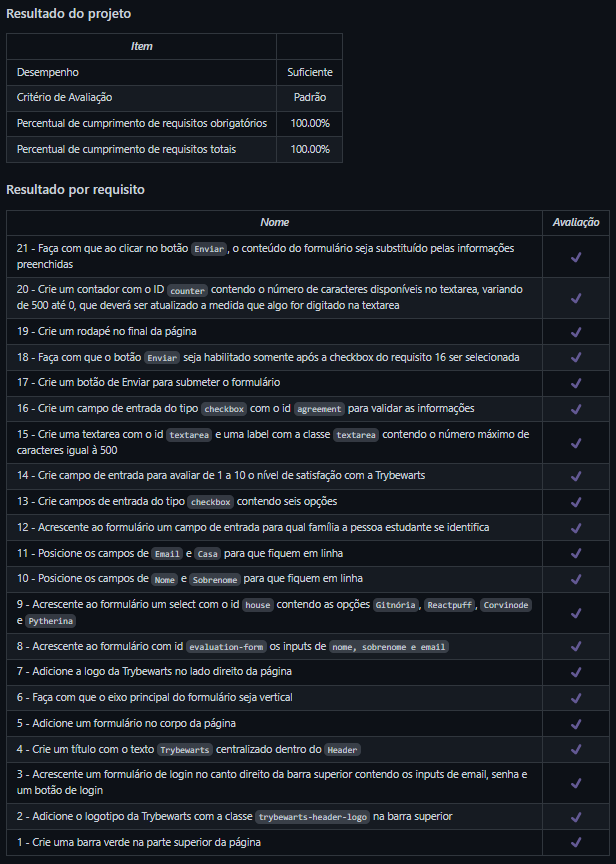

# Trybewarts
Projeto da [Trybe](https://www.betrybe.com/) - Bloco 6 - Formulário construído com HTML, CSS Flexbox e JavaScript.

## 💻 Projeto

Página de formulário de avaliação construída com HTML, CSS Flexbox e JavaScript. 

  
<strong>🏆 Meu desempenho</strong>
 

  

## 🚀 Tecnologias
> Este projeto foi desenvolvido com as seguintes tecnologias:

- HTML
- CSS
- JavaScript

## 📌 Habilidades
> Neste projeto, desenvolvi as seguintes habilidades:

- Criar formulários em HTML;
- Utilizar CSS Flexbox para criar layouts flexíveis;
- Criar regras CSS específicas para serem aplicadas a dispositivos móveis;
- Construir páginas que alteram o seu layout de acordo com a orientação da tela;
- Capturar eventos e executar funções com JavaScript.

## 💬 Contatos

   
   
  

<!-- ## 📄 Licença

Esse projeto está sob licença. Veja o arquivo [LICENÇA](LICENSE.md) para mais detalhes.

[⬆ Voltar ao topo](#nome-do-projeto)  -->
